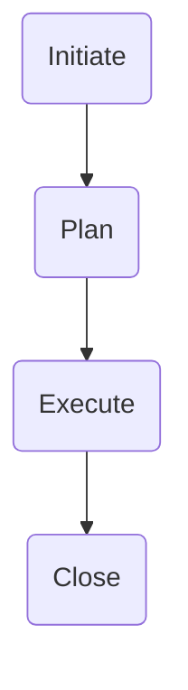

## General Life Cycle

### Initiate
- Define goals and deliverables
- Identify the budget, people, and resources
- Other details to include in proposal
- Get project approval

### Plan
- Create a budget
- Set the schedule
- Establish your team
- Determine role and responsibility
- Plan for **risk and change**
- Estabilish communication

### Execute
- Manage the progress
- Communicate
- Make adjustments

### Close
- Check if tasks are completed
- Confirm acceptance of the project outcome
- Reflection - **Retrospective**
  - > A retrospective is a change to note best practices and learn how to manage a project more effectively the next time
- Communicate with stakeholder
- Celebrate!
- Formally move on from the project

## Methodologies
> Project Management Methodology is a set of guiding principles and processes for owning a project through its life cycle

### Linear
> Means the previous phase or task has to be completed before the next can start

Goal is clear, but not suitable for many change

#### Waterfall

### Iterative
> Means some of the phases and tasks will overlap or happen at the same time that other tasks are being worked on.

#### Agile
- Able to move quickly and easily
- Willing to change and adapt
- DOne in pieces

#### Comparison
<table class="tg">
<thead>
  <tr>
    <th class="tg-0pky"></th>
    <th class="tg-0pky">Waterfall</th>
    <th class="tg-0pky">Agile</th>
  </tr>
</thead>
<tbody>
  <tr>
    <td class="tg-0pky"> Project manager's role</td>
    <td class="tg-0pky">An active leader by prioritizing and assigning tasks to team members.</td>
    <td class="tg-0pky">Agile project manager (or Scrum Master) acts primarily as a facilitator, removing any barriers the team faces.   Team shares more responsibility in managing their own work.    </td>
  </tr>
  <tr>
    <td class="tg-0pky">Scope</td>
    <td class="tg-0pky">Project deliverables and plans are well-established and documented in the early stages of initiating and planning.&nbsp;&nbsp;Changes go through a formal change request process. </td>
    <td class="tg-0pky">Planning happens in shorter iterations and focuses on delivering value quickly.   Subsequent iterations are adjusted in response to feedback or unforeseen issues.</td>
  </tr>
  <tr>
    <td class="tg-0pky">Schedule</td>
    <td class="tg-0pky">Follows a mostly linear path through the initiating, planning, executing, and closing phases of the project.  </td>
    <td class="tg-0pky">Time is organized into phases called Sprints. Each Sprint has a defined duration, with a set list of deliverables planned at the start of the Sprint. </td>
  </tr>
  <tr>
    <td class="tg-0pky">Cost</td>
    <td class="tg-0pky">Costs are kept under control by careful estimation up front and close monitoring throughout the life cycle of the project. </td>
    <td class="tg-0pky">Costs and schedule could change with each iteration. </td>
  </tr>
  <tr>
    <td class="tg-0pky">Quality</td>
    <td class="tg-0pky">Project manager makes plans and clearly defines criteria to measure quality at the beginning of the project.</td>
    <td class="tg-0pky">Team solicits ongoing stakeholder input and user feedback by testing products in the field and regularly implementing improvements.</td>
  </tr>
  <tr>
    <td class="tg-0pky">Communication</td>
    <td class="tg-0pky">Project manager continually communicates progress toward milestones and other key indicators to stakeholders, ensuring that the project is on track to meet the customer’s expectations. </td>
    <td class="tg-0pky">Team is customer-focused, with consistent communication between users and the project team.</td>
  </tr>
  <tr>
    <td class="tg-0pky">Stakeholders</td>
    <td class="tg-0pky">Project manager continually manages and monitors stakeholder engagement to ensure the project is on track.  </td>
    <td class="tg-0pky">Team frequently provides deliverables to stakeholders throughout the project. Progress toward milestones is dependent upon stakeholder feedback.</td>
  </tr>
</tbody>
</table>

### Lean Six Sigma
Process for Improvement (DMAIC)
- **D**efine goal
- **M**easure current problem
- **A**nalyze gap and issues
- **I**mprove 
- **C**ontrol

#### Lean
Implement Lean when using limited resources, reduce waste, and streamline process to gain maximum benefits

**8 Types of waste**
- Defect
- Excess processing
- Overproduction
- Waiting 
- Inventory
- Transportation
- Motion
- Non-utilized talent

**Lean 5S quality tool**
- Sort: remove not needed item
- Set in order: arrange needed items and lable
- Shine: keep everything on the correct place
- Standardize: Perform the process in the same way
- Sustain: Make habit of maintainng correct procedures

**Kanban** 
看板
Include `todo`, `in progress`, `testing`, `done`.

#### Six Sigma
Used to reduce variations by ensuring that quality processes are followed every time.

**7 Principles**
1. Always focus on the customer
2. Identify and understand how the work gets done, how it really happend
3. Make processes flow smoothly
4. Reduce waste and concertrate on value
5. Stop defects by removing variation
6. Involve and collaborate with your team
7. Approvh improvement activity in a systematic way

